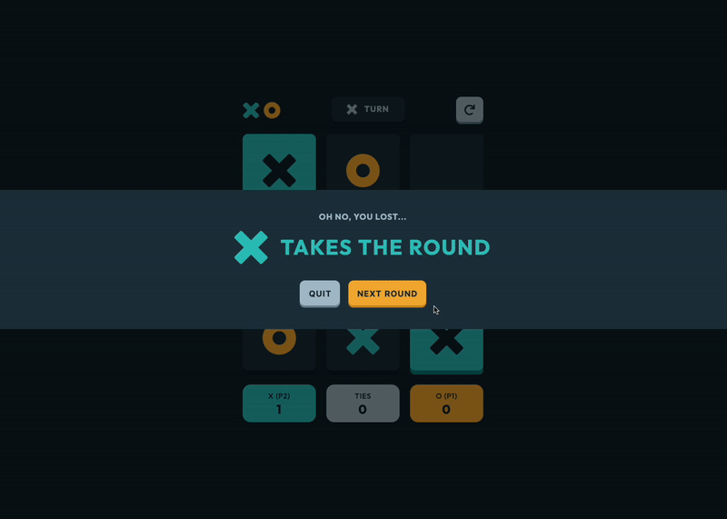

# Tic Tac Toe solution

This is a solution to the [Tic Tac Toe challenge on Frontend Mentor](https://www.frontendmentor.io/challenges/tic-tac-toe-game-Re7ZF_E2v). Frontend Mentor challenges help you improve your coding skills by building realistic projects.

## About the Project

Dive into the classic game of strategy with a modern twist in the **"Tic Tac Toe"** challenge from Frontend Mentor. Crafted with React and supercharged by Vite, this project brings the timeless game to life with flair.

While the game's implementation might be from a bygone era of my coding journey, it still offers a robust challenge, especially on hard mode where the system's moves are calculated with precision.

## Preview and Links

| [Live Demo URL](https://ionstici.github.io/tic-tac-toe) | [Frontend Mentor](https://www.frontendmentor.io/solutions/tic-tac-toe-with-difficulty-levels-LflyNgT-Pd) |
| ------------------------------------------------------- | -------------------------------------------------------------------------------------------------------- |



## Features

- **Player vs Player & vs System:** Options for multiplayer or single-player mode against system.
- **Player Selection:** Choose to play as 'X' or 'O'.
- **Difficulty Levels:** Easy, normal, and hard modes when playing against the system.
- **Animated Interactions:** Modals and game elements have playful animations.
- **Score Tracking:** Keeps track of wins, losses, and ties for a competitive edge.
- **Responsive Design:** SCSS ensures the game looks good on all devices.

## Tech Stack

- **`React`:** For building interactive UI components.
- **`Vite`:** To provide a fast and efficient development environment.
- **`SCSS`:** For styling, allowing for complex animations and a clean design.

## Deployment

This project is hosted on [**GitHub Pages**](https://pages.github.com).

## Getting Started

You will need [`Node.js`](http://nodejs.org) installed on your computer for this project to run.

```bash
# 1. Clone the Repository
git clone https://github.com/ionStici/tic-tac-toe.git

# 2. Navigate to project's Repository
cd tic-tac-toe

# 3. Install dependencies
npm install

# 4. Run the development server
npm run dev
```

## License

This project is licensed under the MIT License. See [LICENSE](./LICENSE) file for more information.

## Contact

- [ionStici | GitHub](https://github.com/ionStici)
- [Ion Stici | LinkedIn](https://www.linkedin.com/in/ionstici/)

Feel free to reach out if you have any questions or suggestions!
